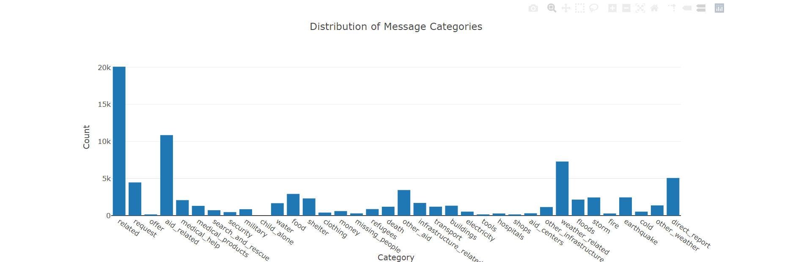

# Disaster Response Pipeline Project 
#### As part of Udacity Data Scientist Nano Degree Program

## Table of Contents
1. [Introduction and Project Description](#Introduction)
2. [Getting Started](#Getting_Started)
	1. [Dependencies](#Dependencies)
	2. [Project Directory Contents](#Contents)
	3. [Program Execution Commands](#Execution)
	4. [System Resource](#System_Resource)
3. [Authors](#Authors)
4. [Acknowledgement](#Acknowledgement)
5. [Screenshots](#Screenshots)

## 1. Introduction and Project Description

This Project is part of Udacity Data Scientist Nanodegree Program. The Objective of this project is to build a Supervised Machine Learning model using ETL and ML pipeline of pre-labelled tweets and text messages received from real life disaster dataset. Essentially  the model should categorize and classify disaster response messages on a real time basis deployed on the web through Flask app.

This project is divided in below 3 sections:

1. ETL Pipeline: An ETL pipeline to extract data from csv files, clean data and save to a SQLite DB Table.
    
    process_data.py file contains the code for ETL Pipeline
    
2. ML Pipeline: A text processing and machine learning pipeline (to classify text message in various categories) which Loads data from the SQLite database table, Splits the dataset into training and test sets, Trains and tunes the model using GridSearchCV and save the model as pickle file

    train_classifier.py file contains the code for building the ML Pipeline
    
3. Flask Web App: A web app which can host the model and classify the input text message to various categories in real time.

Here is an overview of the web interface running on http://localhost:3001/

## 2. Getting Started

### 2.1 Dependencies
* Python 3.5+
* Python Pandas, Machine Learning Libraries: NumPy, Pandas, Scikit-Learn, SciPy, pickle
* Natural Language Process Libraries: NLTK
* SQLlite Database Library: SQLAlchemy
* Web App and Data Visualization: Flask, Plotly
* Misc: time, re (Regular Expression)

## 2.2 Project Directory Contents
* **Data:**

    process_data.py: contains code for ETL Pipeline. The script reads data, cleans and stores it in a SQL database.
    
    disaster_categories.csv and disaster_messages.csv: pre-labelled tweet and messages from real-life disaster situation. 
    
    DisasterResponse.db: gets created as part of transformed and cleaned data by process_data.py script

* **Models:**

    train_classifier.py: includes the code necessary to load data, transform it using natural language processing, run a machine learning model using             GridSearchCV and train it. 

* **App:**

    run.py: Flask app and the web interface used to predict results, classify categories and display them in UI.
    
    templates: folder containing the html templates
    
* **Screenshots:**

    Screenshots taken from UI displaying the input message by classifying different categories.

* **Root Directory:**

    Contains the Jupiter notebooks of the ETL and ML Pipeline process.
    
    ETL Preparation Notebook: Implements ETL pipeline
    
    ML Pipeline Preparation Notebook: Machine Learning Pipeline developed with NLTK and Scikit-Learn, to train, tune and test the model.
    

### 2.3 Program Execution Commands
1. Following commands need to run on the project root directory to set up the ETL and ML pipelines that will save the pre-processed data into a SQLLite DB and the ML model as pickle file.

    a- To run ETL pipeline that pre-processes data and stores in database
    
            `python data/process_data.py data/disaster_messages.csv data/disaster_categories.csv data/DisasterResponse.db`
        
    b- To run ML pipeline that trains the model and saves as pickle file
    
            `python models/train_classifier.py ./data/DisasterResponse.db models/classifier.pkl`
        
    c- Run the following command to run web app.    
            `python ./app/run.py`

2. Go to http://localhost:3001/ to see the web interface.

### 2.4 System Resource

To run the ML Pipeline, it is recommended to use an environment having good system resources, at least 8 GB RAM or above and 4 CPUs. Since the system I used having 32 GB RAM and 16 core processors, it took few minutes to complete the train classifier python script, otherwise it may take bit time. 

In my case, code for total execution time to build and train the model are added to both the ML pipeline python script and Jupiter notebook for reference.

## 3. Authors

* [Siddharth Sabat](https://github.com/siddharthsabat)
* Link to clone the GitHub Repo is [here](https://github.com/SiddharthSabat/Data-Science-and-ML-Portfolio/tree/main/Disaster%20Response%20Project)

## 4. Acknowledgements

* Thanks to [Udacity](https://www.udacity.com/) for creating such a wonderful Data Scientist Nanodegree Program containing comprehensive course material for aspiring Data Scientists and awesome projects like this one and few more. Here is the link for the data scientist program detail: [Click Here](https://www.udacity.com/course/data-scientist-nanodegree--nd025)
* Thanks to [Figure Eight](https://www.figure-eight.com/) for providing the datasets.

## 5. Screenshots

1. Overview of the web interface will be displayed in browser after the [Program Execution Commands](#Execution) steps followed.  

   

2. Input text message for the ML model to classify different categories and display under results section. 
   
   **Input message Example-1: We lost few of our family members, need some shelter to stay, we are running out of money and homeless, need urgent help.**

   

3. Input text message for the ML model to classify different categories and display under results section. 
   
   **Input message Example-2: We have no food to eat, no medicine. We cannot feed our children, please urgently help.** 
   
   
4. Screenshot of the ETL pipeline command and its output from Anaconda prompt
   

5. Screenshot of the ML pipeline command and its output from Anaconda prompt
   
   

6. Screenshot of the web App command and its output from Anaconda prompt
   

7. The main page shows some graphs about training dataset, provided by Figure Eight
   
