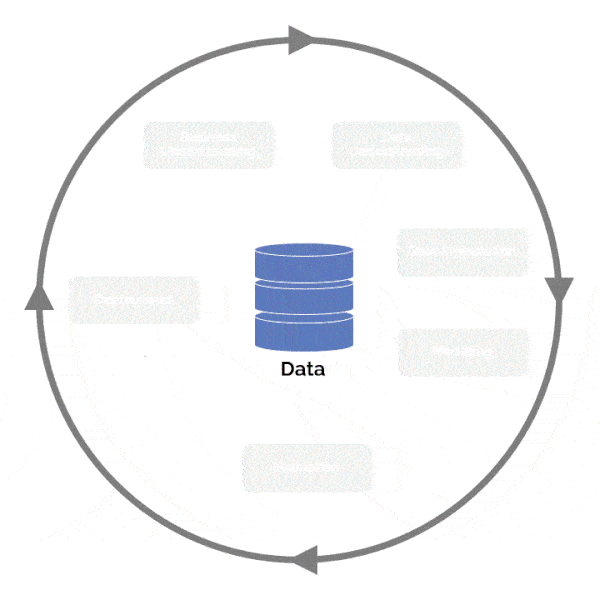

# Data Analysis of Airbnb Boston listings and Price Prediction using CRISP-DM Process
### A blog post project as part of my Udacity Data Scientist Nanodegree Program

### Table of Contents

1. [Project Overview](#Overview)
2. [Libraries](#libraries)
3. [Project Directory Contents](#Contents)
4. [Summary of Analysis to answer Business related queries](#Summary)
5. [Authors](#Authors)
6. [Acknowledgement](#Acknowledgement)

### 1. Project Overview:

The objective of this project is to analyse Airbnb Boston listings, predict property prices and find meanful insights using various data visualization techniques and at the same time to write a data science blog post by describing major phases of industry standard CRISP-DM process. 

Data explored as part of this project includes listing activities of homestays in Boston city from Sep 2016 to Sep 2017. It has 3585 property listing s and 95 variables containing info about host, host types, neighborhoods, price, reviews, property types, room types and much more. The data is obtained from [Inside AirBnB](http://insideairbnb.com/get-the-data.html). The Jupiter Notebook with all detailed code with analysis and visualization can be found [here](https://github.com/SiddharthSabat/Data-Science-and-ML-Portfolio/tree/main/Write%20a%20Data%20Science%20Blog%20Post).

CRISP-DM known as Cross-industry standard process for data mining, is an open standard process model that describes common approaches and best practices used by data mining experts and is the most widely used analytics model in majority of Data Science projects. Being a cross-industry standard model notwithstanding its domain or destination makes this process an unique model to adapt and implement in any Data Science projects. 
This process has 6 phases outlined below. Each phase corresponds to specific activities that usually exist in any Data Science projects.

1. Business Understanding
2. Data Understanding
3. Data Preparation
4. Modeling
5. Evaluation
6. Deploy

The below diagram is a pictorial depiction of this process. 

    
Motivation behind this project focuses on answering following business-related questions using CRISP DM process.

1. Which are the neighborhoods with highest listings?
2. Find out the most and the least expensive neighborhoods.
3. How does pricing fluctuate in a monthly basis and which time of the year normally the price are high?
4. Which property types and room types are comparatively listed the most?
5. How are the listings distributed across the Boston city?
6. Create a model to predict property pricing.
7. What are the features that influence the property pricing?

### 2. Libraries 

Below python libraries are used as part of the project using Jupiter Notebook.

* Pandas
* Matplotlib
* Numpy
* Sklearn
* Seaborn
* Folium

### 3. Project Directory Contents 

* **Data:**

    listings.csv: File obtained from [InsideAirBnB](http://insideairbnb.com/get-the-data.html)
    
    calendar.csv: File obtained from [InsideAirBnB](http://insideairbnb.com/get-the-data.html)
    
* **Screenshots:**

    This folder contains many screenshots generated from matplotlib, seaborn and folium map visualization codes as part of project analysis.

* **Root Directory:**

    Airbnb_Boston_Data_Analysis_and_Prediction.ipynb: Jupyter notebook containing the project code, analysis and visualization used to answer           business question.
    
    readme.md: readme file about the project description and content.

### 4. Summary of Analysis to answer Business related queries  

1. **Which are the neighborhoods with highest listings?**

    There are total of 25 neighborhoods listed in this AirBnB boston listings dataset. The neighborhood with the most listings is Jamaica Plain         with 342 listings which is 9.61% of the total listings. The second highest district in the order is South End with 318 listings which is 8.94%     of the total listings. Black Bay, Fenway and Dorchester districts are in the top 5 list of highest listings.

2. **Find out the most and least expensive neighborhoods?**

    South Boston Waterfront is the neighborhood that concentrates just 2.33% of the total listings, is the most expensive neighborhood with a mean     price of USD 306. Mattapan which is the neighborhood with just 0.67% of total listings, is the least expensive neighborhood with a mean listing     price of USD 75 which makes sense.

3. **How does pricing fluctuate in a monthly basis and Which time of the year normally the price are high?**

    The most expensive months of Boston property listings price are from late August to end of October and the least expensive are from Jan to         March. This monthly price fluctuation correlates with the warm and cold seasons and because of may events and festivals planned during these       periods.

    There is a peak in September with an average price of 237 USD followed by 233 USD in October, since these are the most popular months to have       vacations in the city which makes sense for the peak prices.

    Also our analysis represents these facts from web as it is evident that best time of the year to visit Boston starts from late July through         October, when travelers/tourists have the best chance to experience pleasant weather for walking the Freedom and Black Heritage Trails, and all     attractions open to visitors. Mid to late October is a great time for Boston sightseeing while taking in the gorgeous New England fall leaves.

    Another incentive might help to catch a great deal on a hotel there. If winter is too cold for you but summer and autumn's hotel rates fall         outside your budget, try visiting at the start of the spring season which is around the Feb End and March period when the prices are               comparatively cheaper.

    Hence it makes sense, the average prices for the property listings are bit high during August to October period and our analysis represents the     reality here.

4. **Which property types and room types are comparatively listed most?**

    From the above Property_types listing visualization,  its transparent that the most frequently listed type is Apartments with 2592 listings         which is 72.87% of the total property types. Houses are listed the second most with 556 listing i.e. 15.63% of the total and Condominiums           follow with 231 listings which is 15.63% of the total.
    
    From the above Room_types listing visualization, its noticeable that Entire home/apt types are listed the most, having count of 2113 which is       59.4% of the total room types. "Private room" room types listed the second most having 1365 count i.e. 38.38% of the total followed by Shared       rooms with 79 listings which is just 2.22% of the total.
    
    Since the Apartments Property types and Entire home/apt room types are the most listed categories, it will definitely help Airbnb business         leaders to put more focus on these types of categories to expand the business and maintain a healthy relationship with respective property         owners. Also time to time some free services can be offered to these type of property owners to maintain a long-term relationship that will         eventually help company's stable growth over the years.

5. **How are the listings distributed across the Boston city?**

    The listing distribution map shows a dense number of listings are distributed along the motorway and railway. The listings are highly populated     around Back Bay and South End (1089 listings), North End (641 listings), Near Roxbury (606 listings), Brighton (317 listings).
 

6. **What are the features that influence the property pricing?**

    Based on the distribution of cancellation policy data, Price for Listings of supper strict policy range between 200 USD to nearly 480 USD and data           suggests this price distribution is symmetric and it influences the price much as the median value of these policy types are around 300 USD which is         much higher than the median of other cancellation policies. 

    However, the outliers in other three policies distributed till the maximum price range around 580 USD makes these right skewed. Considering 75th             percentile in the box plot for Flexible are less than 100 USD to 170 USD, for Moderate and strict policy the 75th percentile is between 160 USD to 230       USD. Spread of Moderate and strict policies price suggest more variability compared to the other policies.

    Based on the price distribution of property types, data suggests price variability is more for Villas and other property types. Large number of Villas       are available in the median price range of 170 USD and other types available in median price range around 230 USD influences the price much. Further our     analysis s depicts, though House types are having much outlier in the data set but based on the median values House and Dorm types are less expensive       and Condominium type properties are slightly expensive than Apartments.

7. **Create a model to predict property pricing.**

    From the model evaluation process, here are the observations:

    The R squared score on the Linear Regression test data is: 0.42297519425398933 and score on the RandomForestRefressor test data is:                 0.4603537443328003.
    
    Mean Absolute Error on Linear Regression test data is: 52.968207661647 and Mean Absolute Error on RandomForest Regressor test data is:             45.3513202247191 which indicates the RandomForestRefressor model is performing better.
    
    From both the RandomForestRefressor and Linear Regression price difference plots (between y_test true/actual values and y_predicted values),       its noticeable that most of the points fall around -100 to 100, which indicates there is not much difference between the actual values and the     predicted property values. When looking further at the plots, we can conclude the points are slightly away from zero in the Linear Regression       plot where as in case of the RandomForestRefressor plot, the points are much cluttered around 0, which indicates the RandomForestRefressor         model is performing better compared to the Linear Regression model. Hence the difference between the actual and predicted prices are less in       Random Forest regression model compared to the Linear regression model. So for prediction, RandomForestRefressor model can be chosen.

## 5. Authors

* [Siddharth Sabat](https://github.com/siddharthsabat)
* Link to clone the GitHub Repo is [here](https://github.com/SiddharthSabat/Data-Science-and-ML-Portfolio/tree/main/Write%20a%20Data%20Science%20Blog%20Post)

## 6. Acknowledgements

* Thanks to [Udacity](https://www.udacity.com/) for creating such a wonderful Data Scientist Nanodegree Program containing comprehensive course material for aspiring Data Scientists Here is the link for the data scientist program detail: [Click Here](https://www.udacity.com/course/data-scientist-nanodegree--nd025)
* Data obtained from [Inside AirBnB](http://insideairbnb.com/get-the-data.html)